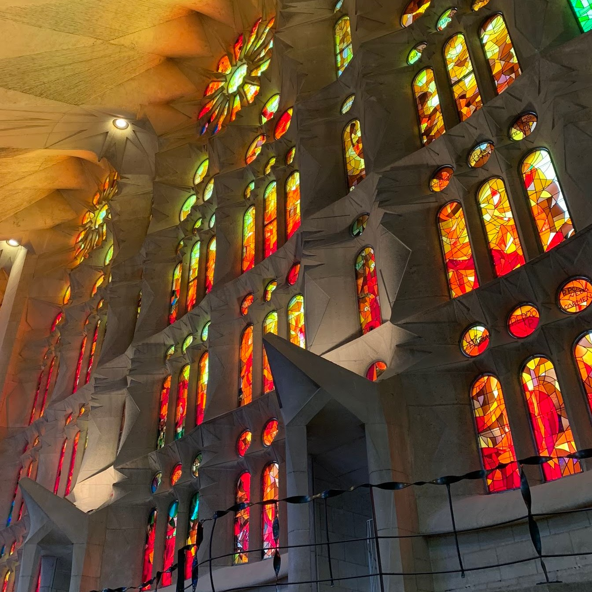

## Barcelona

We stayed in Barcelona twice, taking a 5 day break off in the middle off the coast in Mallorca. Both accomodations were in Eixample, Negresco Princess then later an apartment near Universitat de Barcelona, but their proximity to both the beach and must see destination Sagrada Familia gave us a chance to make the city home for our visit.  
 

 

We could enjoy sunset with 360 degree views from the Negresco Princess rooftop. 

Bluefin tuna with wasabi ice cream from [Vivant](http://vivant.eltenedor.rest/en_GB/#)

Relaxing surrounded by the local flora at [Ciutadella Park](https://goo.gl/maps/fbnChVuHryxSgr4W6)

The natural light and sun room for the apartment.

