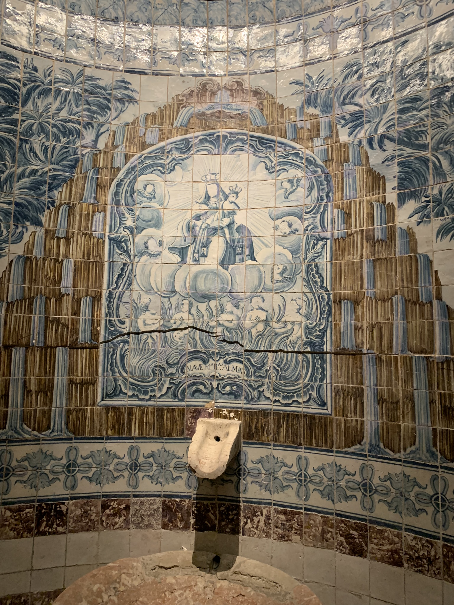
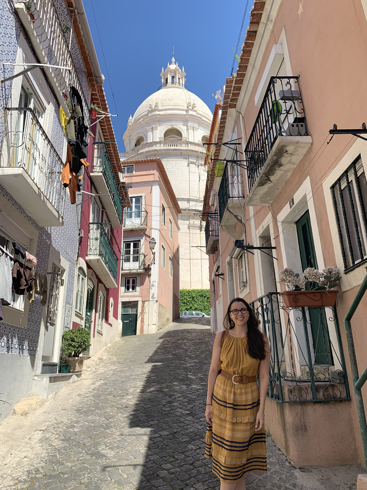
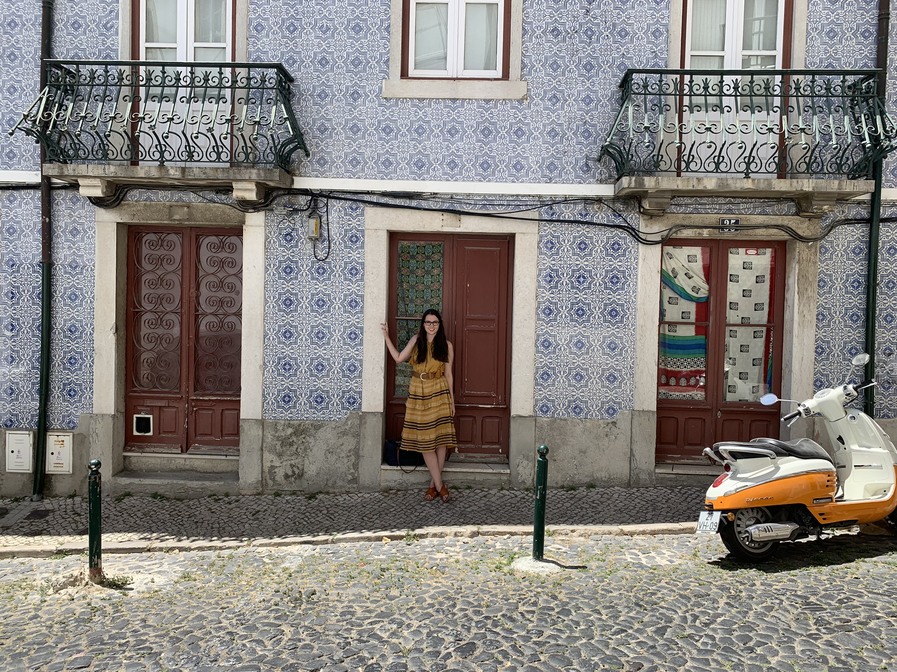

## Description

Hi!
I hope you enjoy our travels logged here. First stop was an adorable apartment within a 17th century palace in Alfama. 

We loved the location and the neighborhood experience and are excited to share with you. While in Lisbon, these places stand out as exceptional in their area of expertise for food and beverage. 

1. [Prado](https://goo.gl/maps/tUWA9eDKGNgB3dXq9).
2. [Clube Do Bacalhau](https://www.clubedobacalhau.com/)
3. [Pensao Amor](https://goo.gl/maps/bqjxCtWbrCX2VHXN6)

## Here are some photos of our time in Lisbon.

