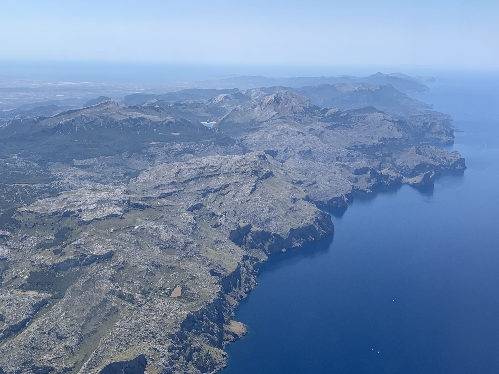
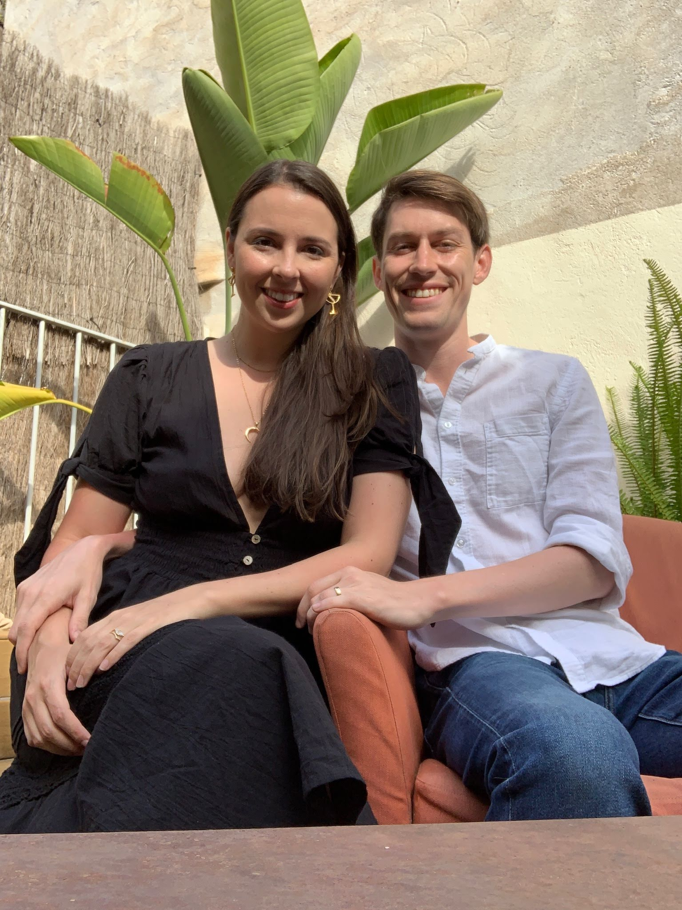
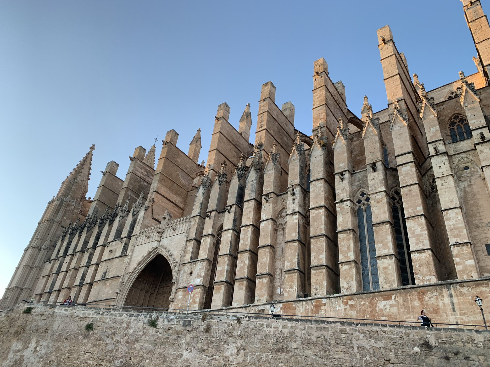
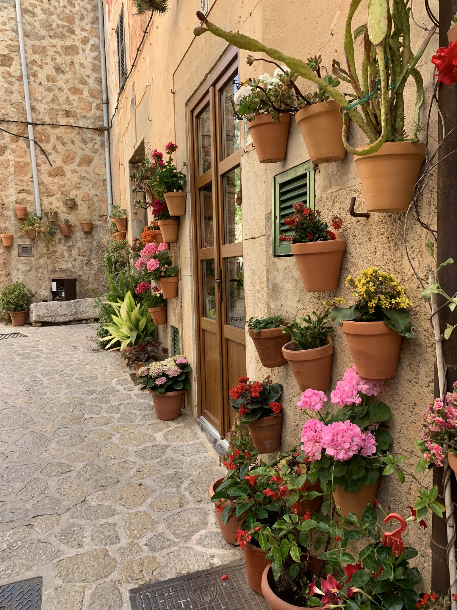
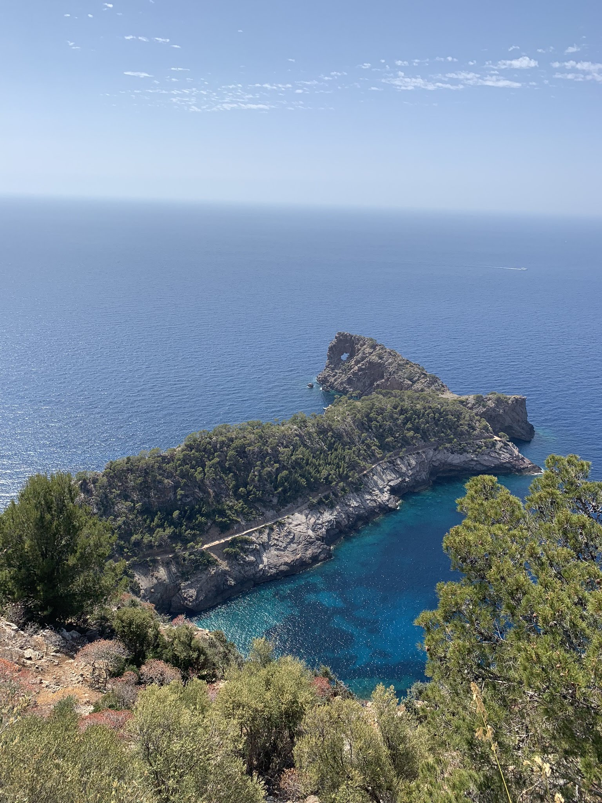
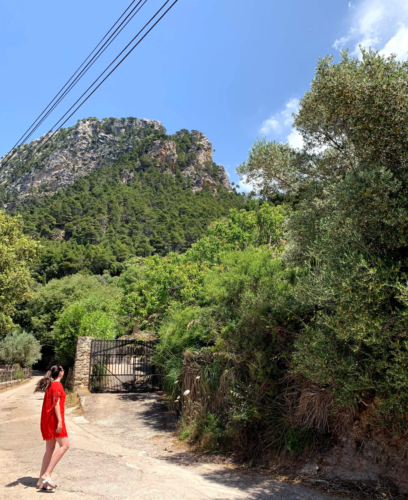
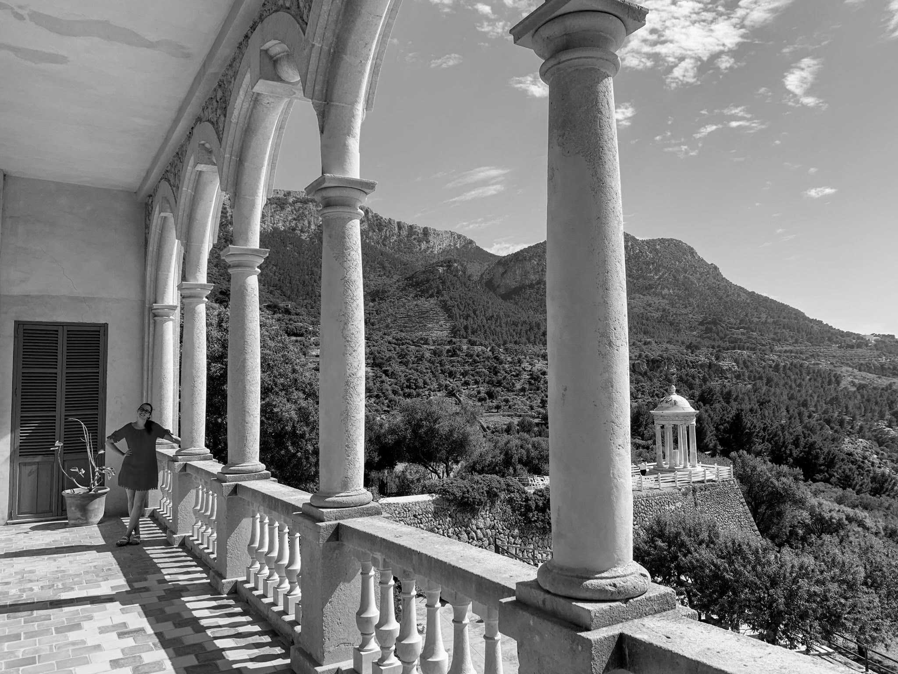
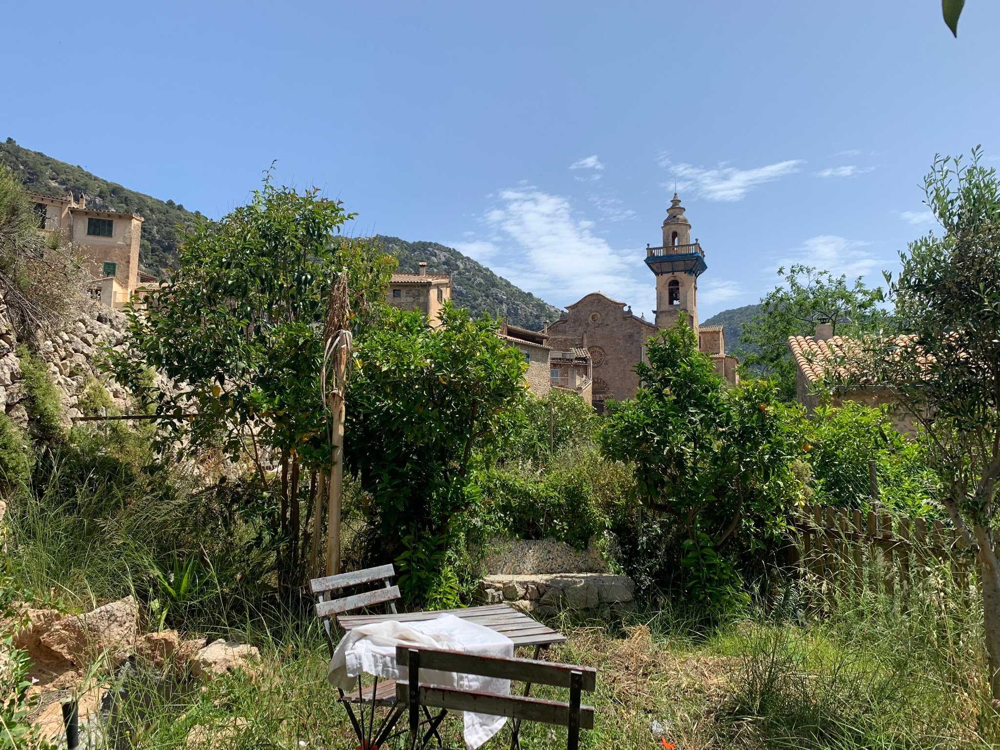
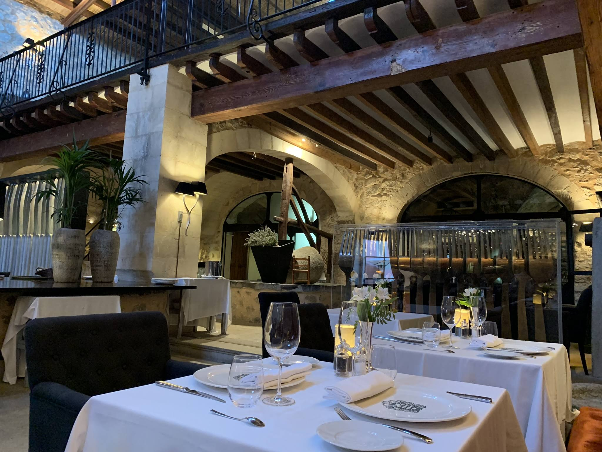

## Description

We spent five amazing nights in Mallorca, two in Palma and three in Valldemossa. The hills and beaches are visible as we fly in from Barcelona.

In Palma, we stayed with Brondo Architect Hotel and enjoyed a private terrace when we were not out and exploring the city.

The Santa Iglesia Catdral de Mallorca is impossible to miss from any spot in Palma and provided a convenient visual reference point.

Valldemossa provided the farthest escape from New York possible. Each night the town settled back into a comforting quiet, protected and surrounded by steep hills. 

Here are just some of the dramatic views available in a 15 minute trip from the town.

The view from our private garden while we stayed in Valldemossa 

and the inside of Gran Hotel Son Net for an unforgettable dinner experience.

